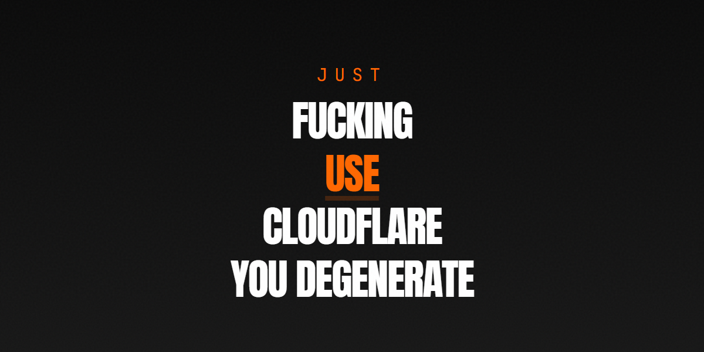

<div align="center">

</div>

# Just Fucking Use Cloudflare

A satirical, high-performance landing page making the case for Cloudflare over multi-vendor cloud spaghetti. Add `?to=Name&from=YourName` to the URL for personalized sharing.

> Satire and educational demo only — not official guidance from any cloud provider.

[](https://react.dev/)
[](https://vitejs.dev/)
[](https://www.typescriptlang.org/)
[](https://tailwindcss.com/)
[](https://bun.sh/)

## Quick Start

```bash
git clone https://github.com/mynameistito/justfuckingusecloudflare.git
cd justfuckingusecloudflare
bun install
bun run dev
```

Open [http://localhost:3000](http://localhost:3000).

## Scripts

| Command | What it does |
|---|---|
| `bun run dev` | Start dev server (port 3000) |
| `bun run build` | Production build → `dist/` |
| `bun run preview` | Preview production build locally |
| `bun run deploy` | Branch-aware deploy (prod vs preview) |
| `bun run fix` | Auto-fix linting and formatting (Ultracite/Biome) |
| `bun run check` | Lint/format check only |
| `bun run typecheck` | TypeScript type checking (`tsc --noEmit`) |
| `bun run ultracheck` | Fix then verify (fix + check) |

<details>
<summary><strong>npm / yarn / pnpm also work</strong></summary>

```bash
npm install && npm run dev
yarn install && yarn dev
pnpm install && pnpm dev
```

The project uses Bun internally (lockfile is `bun.lock`), but any package manager will do.

</details>

## Project Structure

```
justfuckingusecloudflare/
├── src/                    # Vite root (index.html lives here)
│   ├── index.html           # HTML entry
│   ├── index.tsx            # React mount point
│   ├── index.css            # @import "tailwindcss"
│   ├── app.tsx              # Router + HomePage composition
│   ├── components/          # All UI components
│   │   ├── hero.tsx         # Personalized hero banner
│   │   ├── rant.tsx         # Satirical rant section
│   │   ├── comparison.tsx   # AWS vs Cloudflare feature cards
│   │   ├── features.tsx     # Cloudflare feature checklist
│   │   ├── cta.tsx          # Call to action + signup link
│   │   ├── share-link.tsx   # Personalized share URL generator
│   │   ├── thank-you.tsx    # "Sent by X" attribution
│   │   ├── privacy-policy.tsx
│   │   └── footer.tsx
│   └── hooks/
│       └── use-personalization.ts  # ?to= & ?from= URL param hook
├── worker/
│   └── index.ts             # SPA fallback handler
├── scripts/
│   └── deploy.js            # Branch-aware deploy script
├── public/                  # Static assets (favicons, OG image, _headers, webmanifest)
├── vite.config.ts           # Vite config (root=src, Cloudflare plugin)
├── wrangler.jsonc            # Worker name, assets dir, routes
├── biome.jsonc              # Ultracite/Biome linting & formatting
└── tsconfig.json
```

> **Note:** The Vite root is `src/` — `index.html` lives inside `src/`, not the project root.

## Personalization

Append `?to=Name&from=YourName` to any URL to personalize the page:

```
https://justfuckingusecloudflare.com/?to=Alex&from=Sam
```

Names are trimmed and capitalized automatically via `usePersonalization`.

## Deploy

Push to `main` and the deploy script handles the rest:

```bash
bun run deploy
```

The script detects the branch — `main` deploys to production, other branches deploy as preview versions.

### Manual Deploy

```bash
bun run build
npx wrangler deploy
```

## Tech Stack

- **React 19** — UI
- **Vite 8** — Build tool
- **TypeScript 6** — Type safety
- **Tailwind CSS 4** — Styling
- **React Router 7** — Client-side routing
- **Lucide React** — Icons
- **Ultracite / Biome** — Linting and formatting
- **Lefthook** — Git hooks
- **Cloudflare Workers** — Deployment target

## Code Conventions

- Named exports on all components (`export const Name: React.FC = () => ...`)
- No barrel files, no default exports on components
- `const` by default, `let` only for reassignment
- `for...of` over `.forEach()`
- `unknown` over `any`
- No `dangerouslySetInnerHTML` or `eval()`

## Contributing

Open an issue, submit a PR, or just share feedback — contributions are welcome.

## License

See [LICENSE](./LICENSE).

## Legal

This is a community-built, satirical, open-source project. Not endorsed by, sponsored by, or affiliated with any of the companies mentioned.

"Cloudflare" and related names are trademarks of Cloudflare, Inc. "Amazon Web Services" and "AWS" are trademarks of Amazon.com, Inc. All other product names are property of their respective owners and are used for identification and comparative purposes only.

Software is provided "as is", without warranty of any kind.

---
